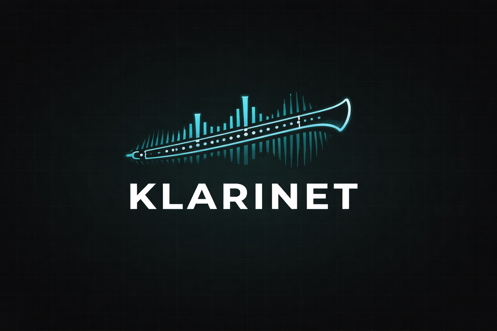
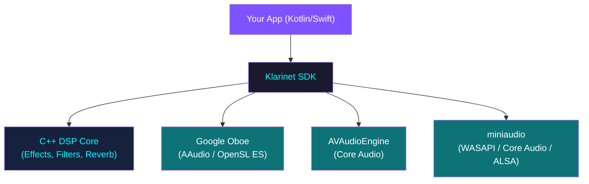

<p align="center">
  
</p>

<p align="center">
  <strong>Low-latency audio SDK for Kotlin Multiplatform</strong>
</p>

<p align="center">
  <a href="https://github.com/vectencia/Klarinet/actions/workflows/ci.yml"></a>
  <a href="https://central.sonatype.com/namespace/com.vectencia.klarinet"></a>
  <a href="https://opensource.org/licenses/Apache-2.0"></a>
  <a href="https://kotlinlang.org"></a>
</p>

---

**Klarinet** is an open-source Kotlin Multiplatform audio library that provides a unified, idiomatic API for low-latency audio playback, recording, file I/O, and real-time effects processing across **8 platforms and 15 targets**.

Write your audio code once in Kotlin. Klarinet delegates to the best native backend on each platform — Google Oboe on Android, AVAudioEngine on Apple, miniaudio on JVM/Linux/Windows — while preserving low-latency characteristics and real-time safety.

## Use Cases

### Music & Audio Production
Build cross-platform DAWs, beat makers, or loop stations. Klarinet's low-latency audio engine and real-time effects chain let users play instruments, apply reverb/delay/compression, and record --- all with professional-grade latency on both Android and iOS.

### Voice & Communication
Add voice processing to chat apps, walkie-talkies, or podcast tools. Use the noise gate to suppress background noise, the compressor to normalize volume levels, and the EQ to shape voice tone --- all running natively in the audio callback with zero overhead.

### Games & Interactive Media
Integrate dynamic audio into games without platform-specific code. Generate procedural sound effects with the callback API, apply spatial effects, and mix multiple audio sources. The low-latency performance mode ensures sounds play the instant they're triggered.

### Audio Analysis & Visualization
Build spectrum analyzers, tuners, or audio visualizers. Klarinet's `levelFlow()` provides real-time metering at 20+ updates/sec via Kotlin Flows, and the callback API gives you raw PCM samples for FFT, pitch detection, or waveform rendering.

### Accessibility Tools
Create hearing aids, sound amplifiers, or audio processing apps for accessibility. The real-time effects chain can boost specific frequencies (parametric EQ), compress dynamic range (limiter), or amplify quiet sounds (gain) --- all with the sub-10ms latency required for live audio passthrough.

### Education & Learning
Build music education apps with real-time feedback. Students play an instrument into the mic, your app analyzes pitch and timing via the callback, and displays results --- while simultaneously applying effects to make practice sound better.

### Podcast & Audio Editing
Decode MP3/AAC/WAV files, apply effects (noise gate + compressor + EQ is a classic podcast chain), and encode the result. Use `AudioFileReader.asFlow()` to stream large files without loading them entirely into memory.

## Highlights

- **One API, every platform** --- Common Kotlin API with native performance across Android, Apple, JVM Desktop, Linux, and Windows
- **Low-latency by default** --- Google Oboe on Android, AVAudioEngine on Apple, miniaudio on JVM/Linux/Windows
- **16 built-in audio effects** --- Gain, EQ, Compressor, Reverb, Delay, Chorus, and more --- powered by a shared C++ DSP core
- **Hot-swappable effect chains** --- Add, remove, and reorder effects while audio is streaming
- **File I/O** --- Decode and encode WAV, MP3, AAC, M4A with metadata reading
- **Coroutines support** --- Optional `klarinet-coroutines` module with Flow-based metering and async I/O
- **SwiftUI ready** --- Use directly from native Swift/SwiftUI apps via Kotlin/Native framework export

## Supported Platforms

| Platform | Targets | Backend | Audio Streaming | File I/O (WAV) | File I/O (AAC/M4A) | Min Version |
|---|---|---|---|---|---|---|
| Android | arm64-v8a, armeabi-v7a, x86_64 | Google Oboe (AAudio / OpenSL ES) | ✅ | ✅ | ✅ | API 24 |
| iOS / iPadOS | arm64, simulatorArm64, x64 | AVAudioEngine | ✅ | ✅ | ✅ | iOS 15+ |
| macOS | arm64, x64 | AVAudioEngine | ✅ | ✅ | ✅ | macOS 12+ |
| tvOS | arm64, simulatorArm64 | AVAudioEngine | ✅ | ✅ | ✅ | tvOS 15+ |
| watchOS | arm64, simulatorArm64 | AVAudioEngine | ✅ | ✅ | ❌ | watchOS 8+ |
| JVM Desktop | macOS, Linux, Windows | miniaudio (WASAPI / Core Audio / ALSA) | ✅ | ✅ | ❌ | JDK 11+ |
| Linux Native | x64, arm64 | miniaudio (ALSA / PulseAudio / JACK) | ✅ | ✅ | ❌ | — |
| Windows Native | x64 | miniaudio (WASAPI / DirectSound) | ✅ | ✅ | ❌ | — |

### watchOS Limitations

watchOS support covers real-time audio streaming and WAV file writing. The following limitations apply due to the Kotlin/Native watchOS bindings not exposing the ExtAudioFile APIs:

| Feature | Status | Notes |
|---|---|---|
| Audio playback (`AudioStream` output) | ✅ Supported | AVAudioEngine, same API as iOS/tvOS |
| Audio recording (`AudioStream` input) | ✅ Supported | Requires mic permission; hardware mic available on Series 3+ |
| Audio session management | ✅ Supported | Full AVAudioSession integration |
| WAV file writing (`AudioFileWriter`) | ✅ Supported | PCM encoding via posix I/O |
| AAC/M4A file writing | ❌ Not available | Throws `UnsupportedFormatException` |
| File reading (`AudioFileReader`) | ❌ Not available | Throws `UnsupportedFormatException` for all formats |
| Audio effects chain | ✅ Supported | Kotlin-side effect processing |
| Swift interop (`AudioStreamCallbackImpl`) | ✅ Supported | Same callback bridge as iOS |

These limitations are a Kotlin/Native toolchain constraint, not a watchOS platform restriction. The underlying Apple APIs (ExtAudioFile) exist on watchOS but are not yet exposed in the K/N bindings.

### JVM Desktop Limitations

JVM desktop support uses miniaudio for low-latency audio I/O across macOS, Linux, and Windows.

| Feature | Status | Notes |
|---|---|---|
| Audio playback (`AudioStream` output) | ✅ Supported | miniaudio callback-driven, low latency |
| Audio recording (`AudioStream` input) | ✅ Supported | miniaudio capture device |
| Audio session management | N/A | No audio session concept on desktop |
| WAV file read/write | ✅ Supported | via miniaudio decoder/encoder |
| MP3 file reading | ✅ Supported | via miniaudio (dr_mp3) |
| AAC/M4A file read/write | ❌ Not available | Throws `UnsupportedFormatException` |
| Push-mode write/read | ❌ Not available | Use callback mode via `AudioStreamCallback` |
| Audio effects | ✅ Supported | Kotlin-side effect processing |

### Unsupported Platforms

| Platform | Reason |
|---|---|
| JS / Browser | Web Audio API is async-first and fundamentally incompatible with Klarinet's synchronous callback model. Browser audio apps should use Web Audio API directly. |
| Wasm / WasmJS | Same limitations as JS — browser sandbox restricts native audio access. |

## Installation

### Kotlin Multiplatform (Compose Multiplatform / KMP)

```kotlin
// build.gradle.kts
repositories {
    mavenCentral()
}

kotlin {
    sourceSets {
        commonMain.dependencies {
            implementation("com.vectencia.klarinet:klarinet:0.1.0")

            // Optional: Coroutines extensions
            implementation("com.vectencia.klarinet:klarinet-coroutines:0.1.0")
        }
    }
}
```

### Native iOS / SwiftUI

Klarinet exports a Kotlin/Native framework that Swift can import directly:

```swift
import Klarinet

let engine = AudioEngine.companion.create()
// ... use the full Klarinet API from Swift
```

See the [SwiftUI Demo](#demo-app) for a complete example.

## Quick Start

### Playback --- Sine Wave Generator

```kotlin
import com.vectencia.klarinet.*
import kotlin.math.sin

val engine = AudioEngine.create()

val callback = object : AudioStreamCallback {
    private var phase = 0.0

    override fun onAudioReady(buffer: FloatArray, numFrames: Int): Int {
        for (i in 0 until numFrames) {
            buffer[i] = sin(2.0 * Math.PI * 440.0 * phase / 48000.0).toFloat()
            phase += 1.0
        }
        return numFrames
    }
}

val stream = engine.openStream(
    config = AudioStreamConfig(
        sampleRate = 48000,
        channelCount = 1,
        direction = StreamDirection.OUTPUT,
        performanceMode = PerformanceMode.LOW_LATENCY,
    ),
    callback = callback,
)

stream.start()
// ... audio is playing ...
stream.stop()
stream.close()
engine.release()
```

### Recording --- Microphone Input

```kotlin
val engine = AudioEngine.create()

val stream = engine.openStream(
    config = AudioStreamConfig(
        sampleRate = 48000,
        channelCount = 1,
        direction = StreamDirection.INPUT,
    ),
)

stream.start()

val buffer = FloatArray(1024)
val framesRead = stream.read(buffer, numFrames = 1024)
// Process recorded audio in `buffer`...

stream.stop()
stream.close()
engine.release()
```

### Audio Effects

Klarinet includes 16 built-in effects powered by a shared C++ DSP core. Effects run natively in the audio callback --- zero JNI overhead on Android, zero interop overhead on Apple.

```kotlin
val engine = AudioEngine.create()

// Create effects
val reverb = engine.createEffect(AudioEffectType.REVERB)
reverb.setParameter(ReverbParams.ROOM_SIZE, 0.7f)
reverb.setParameter(ReverbParams.WET_DRY_MIX, 0.3f)

val compressor = engine.createEffect(AudioEffectType.COMPRESSOR)
compressor.setParameter(CompressorParams.THRESHOLD, -20f)
compressor.setParameter(CompressorParams.RATIO, 4f)

// Build an effect chain
val chain = engine.createEffectChain()
chain.add(compressor)
chain.add(reverb)

// Attach to a stream
val stream = engine.openStream(config, callback)
stream.effectChain = chain
stream.start()

// Update parameters in real-time (lock-free, audio-thread safe)
reverb.setParameter(ReverbParams.WET_DRY_MIX, 0.6f)

// Hot-swap: add/remove effects while audio is playing
chain.add(engine.createEffect(AudioEffectType.DELAY))
chain.remove(compressor)
```

#### Available Effects

| Category | Effects |
|---|---|
| **Basic** | Gain, Pan, Mute/Solo |
| **Dynamics** | Compressor, Limiter, Noise Gate |
| **EQ / Filters** | Parametric EQ (8-band), Low-Pass, High-Pass, Band-Pass |
| **Time-based** | Delay, Reverb (Freeverb) |
| **Modulation** | Chorus, Flanger, Phaser, Tremolo |

### File I/O

#### Reading metadata

```kotlin
val reader = AudioFileReader("/path/to/song.mp3")
val info = reader.info

println("Format: ${info.format}")           // MP3
println("Duration: ${info.durationMs} ms")  // 210000
println("Sample rate: ${info.sampleRate}")   // 44100
println("Channels: ${info.channelCount}")    // 2

val tags = info.tags
println("Title: ${tags.title}")   // "My Song"
println("Artist: ${tags.artist}") // "Artist Name"

reader.close()
```

#### Decoding to PCM

```kotlin
val reader = AudioFileReader("/path/to/audio.wav")

// Read all at once
val samples = reader.readAll() // FloatArray of interleaved PCM [-1.0, 1.0]

// Or stream in chunks
reader.seekTo(0)
while (!reader.isAtEnd) {
    val chunk = reader.readFrames(maxFrames = 4096)
    // Process chunk...
}

reader.close()
```

#### Playback and recording shortcuts

```kotlin
// Play a file
val stream = engine.playFile("/path/to/song.mp3")
stream.start()

// Record to a file
val stream = engine.recordToFile(
    filePath = "/path/to/recording.wav",
    format = AudioFileFormat.WAV,
)
stream.start()
```

### Coroutines Extensions (Optional)

The `klarinet-coroutines` module provides Flow-based observation and suspending file I/O without adding coroutines as a dependency to the core module.

```kotlin
import com.vectencia.klarinet.coroutines.*

// Observe stream state reactively
stream.stateFlow.collect { state ->
    println("Stream state: $state")
}

// Real-time audio level metering (20 updates/sec)
stream.levelFlow().collect { level ->
    // Update VU meter UI (0.0 to 1.0)
}

// Wait for a stream state
stream.awaitState(StreamState.STARTED)

// Async file I/O (runs on Dispatchers.IO)
val samples = reader.readAllSuspend()

// Stream decoded audio as a Flow
reader.asFlow(chunkSize = 4096).collect { chunk ->
    // Process each chunk
}
```

## Architecture



Klarinet is a single Kotlin Multiplatform module using `expect`/`actual` declarations:

- **`commonMain`** --- Public API: `AudioEngine`, `AudioStream`, `AudioStreamConfig`, `AudioStreamCallback`, `AudioEffect`, `AudioEffectChain`, data classes, enums
- **`androidMain`** --- Android implementation via Google Oboe (C++17/JNI). Audio effects process directly in the native Oboe callback --- zero JNI crossing for DSP.
- **`appleMain`** --- Apple implementation via AVAudioEngine. Shared across iOS, macOS, tvOS, and watchOS.
- **`jvmMain`** --- JVM desktop implementation via miniaudio. Covers macOS, Linux, and Windows from a single target with platform-specific native libraries bundled in the JAR.
- **`linuxX64Main` / `linuxArm64Main`** --- Linux native implementation via miniaudio (cinterop).
- **`mingwX64Main`** --- Windows native implementation via miniaudio (cinterop).
- **`cpp/dsp`** --- Shared C++ DSP library compiled for all platforms. Contains all 16 effects, DSP primitives (Biquad, LFO, EnvelopeFollower, CircularBuffer), lock-free effect chain, and SPSC ring buffer.

## Modules

| Module | Artifact | Description |
|---|---|---|
| `klarinet` | `com.vectencia.klarinet:klarinet` | Core SDK: audio I/O, effects, file I/O |
| `klarinet-coroutines` | `com.vectencia.klarinet:klarinet-coroutines` | Optional Flow & suspending extensions |
| `demo` | --- | Compose Multiplatform demo app (Android, iOS, Desktop) |
| `demo-native` | --- | Native console demo apps (Linux, Windows) |
| `iosApp` | --- | Native SwiftUI demo app (iOS, tvOS, watchOS) |

## Demo Apps

The project includes demo applications for every supported platform:

### Compose Multiplatform Demo (Android + iOS + Desktop)

5 screens: Tone Generator, Mic Meter, Latency Benchmark, File Player, Effects Chain. Runs on Android, iOS, and JVM Desktop (macOS, Linux, Windows) from shared Compose UI code.

```bash
# Run desktop demo
./gradlew demo:run
```

### Native SwiftUI Demo (iOS + tvOS + watchOS)

Native SwiftUI tone generator demo for each Apple platform. The iOS app includes 5 full screens with MVVM architecture; tvOS and watchOS have simplified UIs adapted for their form factors.

### Native Console Demo (Linux + Windows)

Minimal command-line demos that play a 440 Hz sine wave for 3 seconds, proving low-latency audio works on each native target.

## API Reference

### Core Types

| Type | Description |
|---|---|
| `AudioEngine` | Entry point. Creates streams, effects, and queries devices. |
| `AudioStream` | Playback or recording stream with lifecycle control. |
| `AudioStreamConfig` | Stream configuration: sample rate, channels, format, direction. |
| `AudioStreamCallback` | Real-time callback for audio processing (`onAudioReady`). |
| `AudioEffect` | A single audio effect with typed parameters. |
| `AudioEffectChain` | Ordered chain of effects attached to a stream. |
| `AudioFileReader` | Decodes audio files (WAV, MP3, AAC, M4A) to PCM. |
| `AudioFileWriter` | Encodes PCM to audio files (WAV, AAC, M4A). |
| `AudioDeviceInfo` | Information about an audio input/output device. |
| `AudioSessionManager` | Audio session configuration (Apple platforms). |
| `LatencyInfo` | Input/output latency measurements. |

### Enums

| Enum | Values |
|---|---|
| `AudioFormat` | `PCM_FLOAT`, `PCM_I16`, `PCM_I24`, `PCM_I32` |
| `StreamDirection` | `OUTPUT`, `INPUT` |
| `PerformanceMode` | `NONE`, `LOW_LATENCY`, `POWER_SAVING` |
| `SharingMode` | `SHARED`, `EXCLUSIVE` |
| `StreamState` | `UNINITIALIZED`, `OPEN`, `STARTING`, `STARTED`, `PAUSING`, `PAUSED`, `STOPPING`, `STOPPED`, `CLOSING`, `CLOSED` |
| `AudioEffectType` | `GAIN`, `PAN`, `MUTE_SOLO`, `COMPRESSOR`, `LIMITER`, `NOISE_GATE`, `PARAMETRIC_EQ`, `LOW_PASS_FILTER`, `HIGH_PASS_FILTER`, `BAND_PASS_FILTER`, `DELAY`, `REVERB`, `CHORUS`, `FLANGER`, `PHASER`, `TREMOLO` |
| `AudioFileFormat` | `WAV`, `MP3`, `AAC`, `M4A` |

### Exception Hierarchy

```
KlarinetException
  +-- StreamCreationException
  +-- StreamOperationException
  +-- DeviceNotFoundException
  +-- AudioSessionException
  +-- PermissionException
  +-- UnsupportedFormatException
  +-- AudioFileException
```

## Building from Source

### Prerequisites

- **JDK 17** (Temurin recommended)
- **Android SDK** with API level 24+ and NDK
- **Xcode 15+** (for Apple targets, macOS only)

### Build

```bash
# All modules
./gradlew build

# Library only
./gradlew :klarinet:build

# Demo app (Android)
./gradlew :demo:assembleDebug

# Demo app (Desktop)
./gradlew :demo:run

# iOS app (via Xcode)
open iosApp/iosApp.xcodeproj

# Native console demos
./gradlew :demo-native:linkReleaseExecutableLinuxX64
./gradlew :demo-native:linkReleaseExecutableMingwX64
```

### Test

```bash
# Kotlin tests (all platforms)
./gradlew :klarinet:allTests

# C++ DSP tests
cd klarinet/src/cpp/dsp
cmake -B build -DKLARINET_DSP_BUILD_TESTS=ON
cmake --build build
cd build && ctest --output-on-failure

# Coroutines module tests
./gradlew :klarinet-coroutines:allTests
```

### Makefile Shortcuts

| Command | Description |
|---|---|
| `make build` | Build all modules |
| `make klarinet` | Build the library only |
| `make demo` | Build the demo app (Android) |
| `make test` | Run common tests |
| `make test-all` | Run all tests across platforms |
| `make clean` | Clean build artifacts |
| `make publish` | Publish to Maven Central |

## SwiftUI Integration Guide

Klarinet exports a Kotlin/Native framework that native Swift apps can use directly:

```swift
import Klarinet  // or ComposeApp if using the demo framework

// Create engine
let engine = AudioEngine.companion.create()

// Create a callback using the bridge class
let callback = AudioStreamCallbackImpl { buffer, numFrames in
    let frames = numFrames.intValue
    for i in 0..<frames {
        buffer.set(index: Int32(i), value: sinf(phase) * 0.5)
    }
    return numFrames
}

// Configure and open stream
let config = AudioStreamConfig(
    sampleRate: 48000,
    channelCount: 1,
    audioFormat: .pcmFloat,
    bufferCapacityInFrames: 0,
    performanceMode: .lowLatency,
    sharingMode: .shared,
    direction: .output
)

let stream = engine.openStream(config: config, callback: callback)
stream.start()

// Real-time level metering via polling
Timer.scheduledTimer(withTimeInterval: 0.05, repeats: true) { _ in
    let level = stream.peakLevel  // 0.0 to 1.0
}

// Cleanup
stream.stop()
stream.close()
engine.release()
```

## Contributing

See [CONTRIBUTING.md](CONTRIBUTING.md) for development setup, build commands, and PR guidelines.

## License

```
Copyright 2026 Vectencia

Licensed under the Apache License, Version 2.0 (the "License");
you may not use this file except in compliance with the License.
You may obtain a copy of the License at

    http://www.apache.org/licenses/LICENSE-2.0

Unless required by applicable law or agreed to in writing, software
distributed under the License is distributed on an "AS IS" BASIS,
WITHOUT WARRANTIES OR CONDITIONS OF ANY KIND, either express or implied.
See the License for the specific language governing permissions and
limitations under the License.
```

---

<p align="center">
  Built with native performance by <a href="https://github.com/vectencia">Vectencia</a>
</p>
