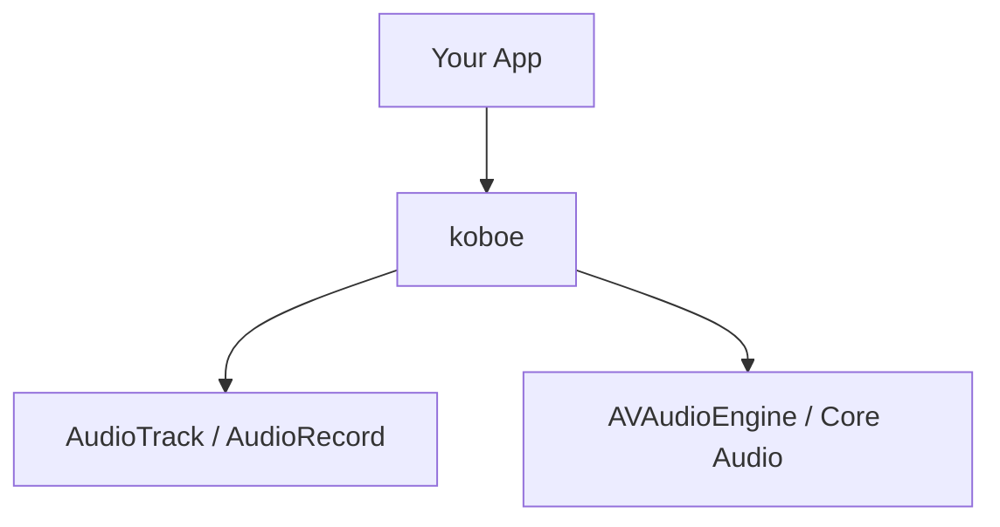

# Koboe

[](https://github.com/vectencia/koboe/actions/workflows/ci.yml)
[](https://central.sonatype.com/namespace/com.vectencia.koboe)
[](https://opensource.org/licenses/Apache-2.0)

**Koboe** is a Kotlin Multiplatform audio library that provides a unified API for low-latency audio playback and recording across Android and Apple platforms. It bridges platform-native audio engines behind a single, idiomatic Kotlin API so you can write audio code once and run it everywhere.

## Why Koboe?

Writing cross-platform audio code today means maintaining separate implementations for Android (AudioTrack/Oboe) and Apple (AVAudioEngine/Core Audio), each with different threading models, buffer management, and lifecycle semantics. Koboe eliminates this duplication with a common API that delegates to the best native backend on each platform, while preserving low-latency characteristics and real-time safety.

## Supported Platforms

| Platform | Backend | Status |
|---|---|---|
| Android (API 24+) | AudioTrack / AudioRecord | Supported |
| iOS / iPadOS | AVAudioEngine | Supported |
| macOS | AVAudioEngine | Supported |
| tvOS | AVAudioEngine | Supported |

## Setup

Add the dependency to your KMP module:

```kotlin
// settings.gradle.kts or build.gradle.kts repositories
repositories {
    mavenCentral()
}
```

```kotlin
// shared/build.gradle.kts
kotlin {
    sourceSets {
        commonMain.dependencies {
            implementation("com.vectencia.koboe:koboe:1.0.0")
        }
    }
}
```

## Quick Start

### Playback (Sine Wave)

```kotlin
import com.vectencia.koboe.*
import kotlin.math.sin

val engine = AudioEngine.create()

// Generate a 440 Hz sine wave via callback
val callback = object : AudioStreamCallback {
    private var phase = 0.0
    private val frequency = 440.0

    override fun onAudioReady(buffer: FloatArray, numFrames: Int): Int {
        val sampleRate = 48000.0
        for (i in 0 until numFrames) {
            buffer[i] = sin(2.0 * Math.PI * frequency * phase / sampleRate).toFloat()
            phase += 1.0
        }
        return numFrames
    }
}

val stream = engine.openStream(
    config = AudioStreamConfig(
        sampleRate = 48000,
        channelCount = 1,
        direction = StreamDirection.OUTPUT,
        performanceMode = PerformanceMode.LOW_LATENCY,
    ),
    callback = callback,
)

stream.start()
// ... audio is playing ...
stream.stop()
stream.close()
engine.release()
```

### Recording

```kotlin
import com.vectencia.koboe.*

val engine = AudioEngine.create()

val stream = engine.openStream(
    config = AudioStreamConfig(
        sampleRate = 48000,
        channelCount = 1,
        direction = StreamDirection.INPUT,
    ),
)

stream.start()

val buffer = FloatArray(1024)
val framesRead = stream.read(buffer, numFrames = 1024)
// Process recorded audio in `buffer`...

stream.stop()
stream.close()
engine.release()
```

### File I/O

#### Reading file metadata and tags

```kotlin
import com.vectencia.koboe.*

val reader = AudioFileReader("/path/to/song.mp3")
val info = reader.info

println("Format: ${info.format}")           // MP3
println("Duration: ${info.durationMs} ms")  // 210000
println("Sample rate: ${info.sampleRate}")   // 44100
println("Channels: ${info.channelCount}")    // 2
println("Bit rate: ${info.bitRate}")         // 320000

val tags = info.tags
println("Title: ${tags.title}")   // "My Song"
println("Artist: ${tags.artist}") // "Artist Name"
println("Album: ${tags.album}")   // "Album Name"

reader.close()
```

#### Decoding a file to PCM

```kotlin
import com.vectencia.koboe.*

val reader = AudioFileReader("/path/to/audio.wav")

// Read all samples at once
val allSamples = reader.readAll() // FloatArray of interleaved PCM [-1.0, 1.0]

// Or read in chunks
reader.seekTo(0)
while (!reader.isAtEnd) {
    val chunk = reader.readFrames(maxFrames = 4096)
    // Process chunk...
}

reader.close()
```

#### Playing a file with AudioEngine.playFile()

```kotlin
import com.vectencia.koboe.*

val engine = AudioEngine.create()
val stream = engine.playFile("/path/to/song.mp3")
stream.start()
// ... audio is playing ...
stream.stop()
stream.close()
engine.release()
```

#### Recording to file with AudioEngine.recordToFile()

```kotlin
import com.vectencia.koboe.*

val engine = AudioEngine.create()
val stream = engine.recordToFile(
    filePath = "/path/to/recording.wav",
    format = AudioFileFormat.WAV,
)
stream.start()
// ... recording ...
stream.stop()
stream.close()
engine.release()
```

## Architecture



**koboe** is a single Kotlin Multiplatform module that defines the common API (`AudioEngine`, `AudioStream`, `AudioStreamConfig`, `AudioStreamCallback`) as `expect` declarations in `commonMain`, with `actual` implementations in `androidMain` (backed by AudioTrack/AudioRecord + Oboe JNI) and `appleMain` (backed by AVAudioEngine).

## Modules

| Module | Artifact | Description |
|---|---|---|
| `koboe` | `com.vectencia.koboe:koboe` | KMP audio SDK: common API + Android and Apple backends |
| `demo` | -- | Demo app with playback and recording examples |

## v1.0.0 Scope

### Included

- Playback and recording streams with callback and blocking I/O modes
- Low-latency performance mode
- PCM Float, I16, I24, I32 sample formats
- Mono and stereo channel configurations
- Audio device enumeration and default device selection
- Audio session management (Apple platforms)
- Stream state lifecycle with error callbacks
- Latency measurement via `LatencyInfo`
- Audio route change notifications
- Android: API 24+ support
- Apple: iOS, iPadOS, macOS, tvOS support

### Not Included (Future)

- Audio effects / DSP processing chain
- Audio file I/O (WAV, MP3, etc.)
- MIDI support
- Desktop JVM (Windows, Linux) targets
- Web (Kotlin/JS, Kotlin/Wasm) targets

## Contributing

See [CONTRIBUTING.md](CONTRIBUTING.md) for development setup, build commands, and PR guidelines.

## License

```
Copyright 2026 Vectencia

Licensed under the Apache License, Version 2.0 (the "License");
you may not use this file except in compliance with the License.
You may obtain a copy of the License at

    http://www.apache.org/licenses/LICENSE-2.0

Unless required by applicable law or agreed to in writing, software
distributed under the License is distributed on an "AS IS" BASIS,
WITHOUT WARRANTIES OR CONDITIONS OF ANY KIND, either express or implied.
See the License for the specific language governing permissions and
limitations under the License.
```
